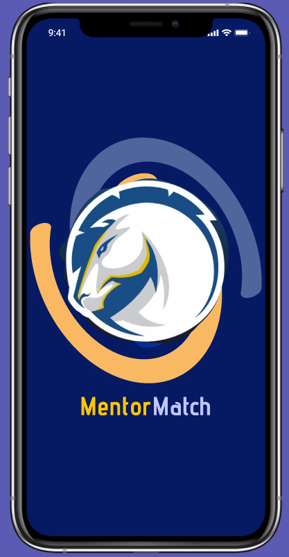
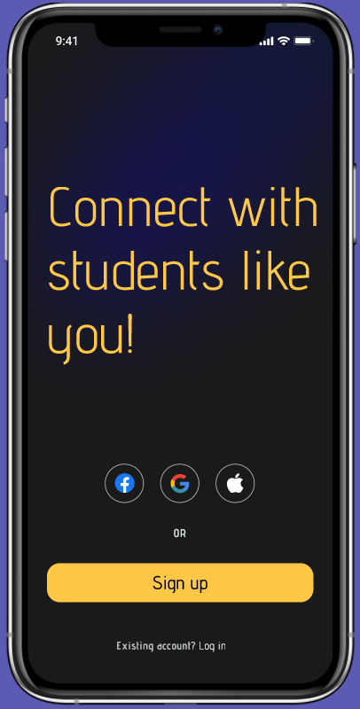
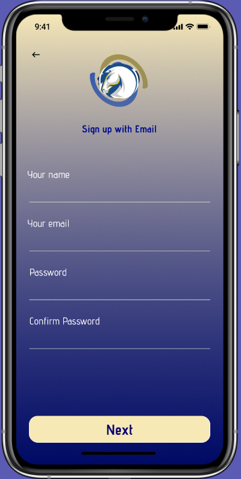
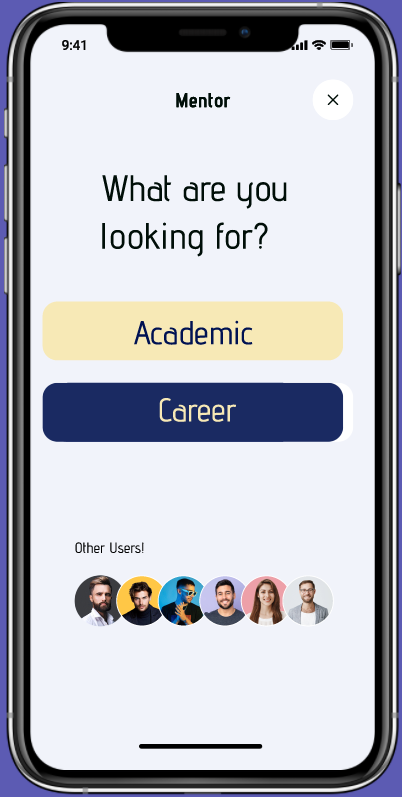
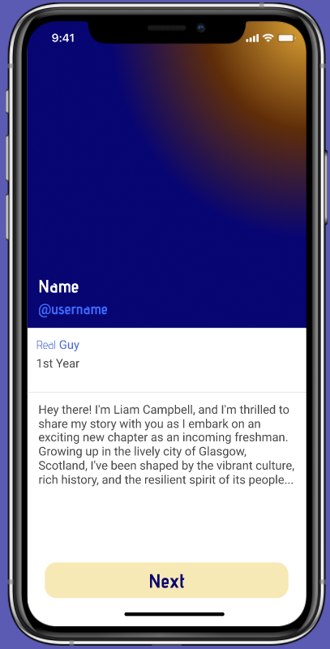
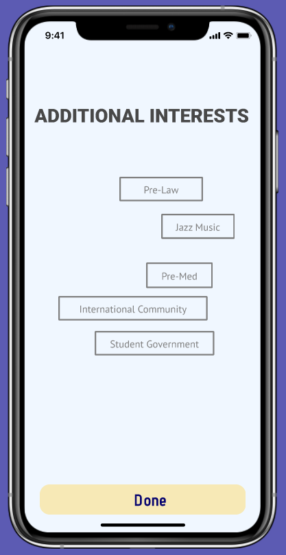
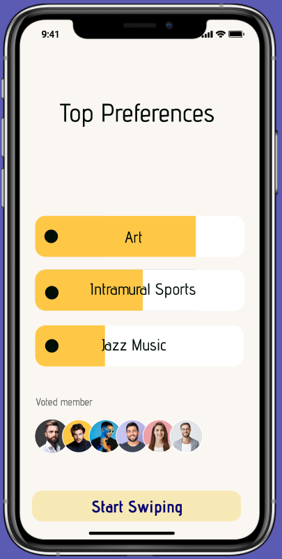
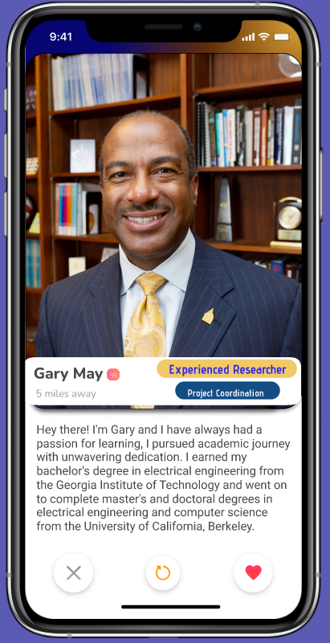
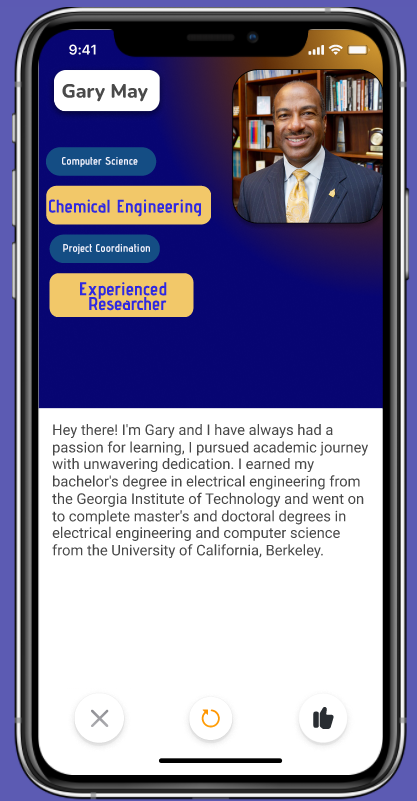
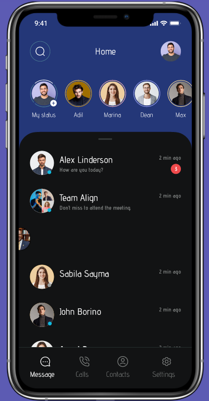

# MentorMatch
The need for mentorship in various fields cannot be overstated. Whether you're a student trying to navigate your career path, a young professional looking to advance your skills, or an entrepreneur seeking guidance on your business, having a mentor can make all the difference. However, finding the right mentor can be a daunting task, with limited options, inadequate information, and often unclear expectations. Students at UC Davis especially lack guidance due to the lack of compatible mentors.

## Solution
That's where Mentor Match comes in. Our app is designed to make the process of finding a mentor and connecting with them seamless and effective. 

By using our app, mentees can browse through a pool of mentors with verified profiles, reviews, and ratings. They can filter their search based on specific skills, industry, and location. Once they find a suitable mentor, they can send a request and start the mentorship journey. 
Our app currently is specifically designed to address the mentorship needs of UC Davis freshmen and sophomores by matching them with UC Davis juniors and seniors. By using our app, mentees can browse through a pool of compatible mentors with verified profiles, reviews, and ratings. They can filter their search based on specific skills, industry, and location. Once they find a suitable mentor, they can send a request and start the mentorship journey.

For mentors, our app provides a platform to share their expertise, gain exposure, network and impart their wisdom. They can create a profile that showcases their skills, experience, and availability. They can communicate with potential mentees, and manage their mentorship engagements. Mentors can also search for mentees by swiping through mentee profiles and sending mentorship requests to those who they believe would be a good fit.

Mentor Match is a two-way street, and we believe that both mentors and mentees should have the power to choose who they work with. Our app allows for mutual communication, so mentors and mentees can discuss expectations and ensure that their mentorship relationship is a good fit for both parties.
 
## Demo
Our user-friendly interface allows for easy navigation and usage of the Mentor Match app. Below are a few screenshots from our app that showcase its functionality.

## Future Work
- Expand the mentor and mentee pool: The app can include more mentors and mentees from different universities and industries to provide more options for users.
- Provide personalized mentor recommendations: The app can use machine learning algorithms to recommend mentors to mentees based on their preferences, learning style, and goals.
- Include a feedback system: To improve the quality of mentorship, the app can include a feedback system that allows mentees to rate their mentorship experience and provide feedback for mentors to improve.
